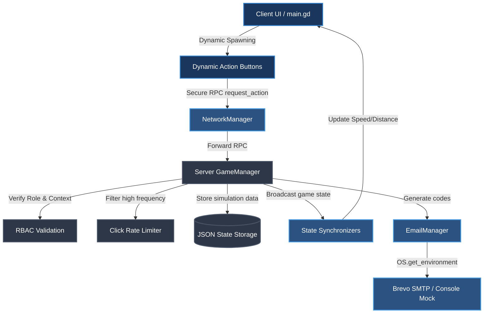

# 🚄 TSA Train - Master Development Roadmap

Welcome to the central command hub and roadmap for **TSA Train**, a high-octane multiplayer incremental sales game. This document tracks completion status, system dependencies, security controls, and dynamic customization architectures.

---

## 📊 Phase Status Overview

| Phase | Milestone Name | Status | Key Focus Area |
| :--- | :--- | :---: | :--- |
| **Phase 1-8** | Local PoC, Networking & Identity | `✅ Completed` | Foundation, BigNum, RPC Networking, Session Persistence |
| **Phase 9** | Headless Server & Unified Admin | `✅ Completed` | Dedicated Server Bootstrap, Client-Side Control Tower |
| **Phase 10** | Mission Control Dashboard | `⚡ In Progress` | Live Speed Grid, Player Latency Inspector, Performance Graphs |
| **Phase 11-18**| Hardening, FTUE & Throttling | `✅ Completed` | Security Lockouts, Recovery Suite, 2FA Verification Logic |
| **Phase 19** | Brevo 2FA Integration | `⚡ In Progress` | Environment-aware SMTP keys, Graceful Mock Fallbacks |
| **Phase 20** | Ngrok Tunneling | `✅ Completed` | Bat Automation, Free Permanent URL support, Local Host Recovery |
| **Phase 21** | Sales Thematic Polish | `✅ Completed` | Points re-balancing (+5 to +20), Sales professional copywriting |
| **Phase 22** | Live Button Customizer | `✅ Completed` | Server-Authoritative Abstract Buttons, Dynamic Spawning |
| **Phase 23** | Bug Reporting & Admin Suite | `🕒 Planned` | Client UI forms, server JSON database, tower dashboard |

---

## 🗺️ System Architecture

---

## 🛠️ Complete Roadmap & Task Breakdown

### Phase 1: Local PoC, Juice & Logic (Completed)
- [x] **Stylize Buttons**: Custom themes and `StyleBoxFlat`.
- [x] **Juice & Animations**: Squash/stretch, score pops, train bobbing, and announcement system.
- [x] **Universal Milestone System**: Data-driven unlocks.
- [x] **Data Persistence**: `PlayerStats` resource with save/load.
- [x] **Phase 1.5: Ultra Juice & Visual Polish**
- [x] **Phase 1.6: Audio Integration**

---

### Phase 2: Extreme Value & Global Sync (Completed)
- [x] **Extreme Value Handling (BigNum)**
    - [x] Create [NumberFormatter](file:///c:/Users/Beman/Documents/Project%20TSA%20Train/scripts/autoloads/number_formatter.gd) autoload for suffix notation (k, M, B, aa...).
    - [x] Update [PlayerStats](file:///c:/Users/Beman/Documents/Project%20TSA%20Train/scripts/resources/player_stats.gd) to use `float` for `total_tickets`.
    - [x] Update UI Labels to use formatted strings.
- [x] **Server-Authoritative Networking**
    - [x] Implement [NetworkManager](file:///c:/Users/Beman/Documents/Project%20TSA%20Train/scripts/autoloads/network_manager.gd) for Hosting/Joining.
    - [x] Integrate `MultiplayerSynchronizer` for Train and Carriages.
    - [x] Server-side validation for sales/speed.
- [x] **Administrative Command Console**
    - [x] Create `AdminConsole` UI (CanvasLayer).
    - [x] Implement [AdminLogger](file:///c:/Users/Beman/Documents/Project%20TSA%20Train/scripts/autoloads/admin_logger.gd) for file-based auditing.
    - [x] Add RPC-based manual overrides for game variables.

---

### Phase 3: Data Continuity & Personal Tracking (Completed)
- [x] **Data & Social Integration**
    - [x] Implement `LeaderboardAPI` with `HTTPRequest`.
    - [x] Create Dynamic `LeaderboardUI` scene.
- [x] **Live Data Synchronization**
    - [x] Implement state rehydration on join (Distance/Speed/Buffs).
    - [x] Set up Personal/Team event log system.

---

### Phase 4: Data Consolidation & Team Structure (Completed)
- [x] **Finalize Team Data Structure**
    - [x] Implement 10 distinct [TeamStats](file:///c:/Users/Beman/Documents/Project%20TSA%20Train/scripts/resources/team_stats.gd) tracks.
    - [x] Hide unused teams from the UI.
    - [x] Enforce TSA Email convention (`firstname.lastname@tsagroup.com.au`).
    - [x] Assign players to specific Team Trains.

---

### Phase 5: Progression & Atmosphere (Completed)
- [x] **Environmental Scaling**
    - [x] Implement "Space Flight" transition animation.
    - [x] Set up `Curve`-based gravity/environment scaling.

---

### Phase 6: Secure Authentication & Identity (Completed)
- [x] **Credential-based Accounts**
    - [x] Remove `TSA2026` global passcode.
    - [x] Implement Register/Login flow using TSA email and password.
- [x] **Server-side Security**
    - [x] Password hashing & salting (SHA-256).
    - [x] Secure session persistence.

---

### Phase 7: Persistent User Management (Completed)
- [x] **Data Decoupling**
    - [x] Refactor Wipe Save to "Reset Simulation" (keeps users intact).
    - [x] Separate User Database from Simulation State.
- [x] **Admin Identity Suite**
    - [x] User Search/List panel in Control Tower.
    - [x] Admin Team-Assignment override (move players).
    - [x] Ban/Deactivate system.
    - [x] Remote Rename capability.
- [x] **Resilience & Error Handling**
    - [x] Detect mid-game server disconnection.
    - [x] Implement "Connection Lost" UI overlay.
    - [x] Graceful return-to-menu flow.

---

### Phase 8: Refactoring & Polish (Completed)
- [x] **Networking Configuration**
    - [x] Create [ConfigManager](file:///c:/Users/Beman/Documents/Project%20TSA%20Train/scripts/autoloads/config_manager.gd) autoload.
    - [x] Allow manual IP entry on Login Screen.
- [x] **Performance Optimization**
    - [x] Debounce JSON saving in [GameManager](file:///c:/Users/Beman/Documents/Project%20TSA%20Train/scripts/autoloads/game_manager.gd) (prevent disk I/O bottlenecks).
- [x] **Auth & UI/UX**
    - [x] Stop storing plaintext passwords locally.
    - [x] Separate Login and Register UI tabs.

---

### Phase 9: Unified Admin & Headless Server (Completed)
- [x] **Role-Based Access Control (RBAC)**
    - [x] Add `role` field to User Database.
    - [x] Secure Admin RPCs with strict server-side validation.
- [x] **Dedicated Server Logic**
    - [x] Implement headless bootstrap mode.
    - [x] Automate hosting on startup.
- [x] **Integrated Dashboard**
    - [x] Add Admin button to [main.gd](file:///c:/Users/Beman/Documents/Project%20TSA%20Train/scripts/ui/main.gd) (conditional).
    - [x] Refactor [ControlTower](file:///c:/Users/Beman/Documents/Project%20TSA%20Train/scripts/admin/control_tower.gd) to work as a client-side dashboard.

---

### Phase 10: Mission Control Dashboard (IN PROGRESS)
- [x] **Grid-based Team Overview**
    - [x] 15-team status grid with live speed/distance updates.
    - [x] Color-coded status indicators (Idle, Moving, Fast).
    - [x] High-tech "Mission Control" theme (UI/UX).
- [x] **Team Detail Sub-menus**
    - [x] Member list (TSA Emails) for each team.
    - [x] Localized "Sales Log" for team-specific interaction history.
- [x] **Admin Overrides & Data Safety**
    - [x] Global "Wipe All Data" button (JSON cleanup).
    - [x] Live Speed/Distance overrides in `TeamDetailModal`.
- [/] **Advanced Monitoring**
    - [/] Player Inspector for connection details (last click/latency).
    - [ ] Real-time performance graphs (Speed/Distance).

---

### Phase 11: Permanent Static Tunnel (Completed)
- [x] **Hardcode Permanent URL**
    - [x] Add `PERMANENT_TUNNEL_URL` to [ConfigManager](file:///c:/Users/Beman/Documents/Project%20TSA%20Train/scripts/autoloads/config_manager.gd).
- [x] **Simplify Login Flow**
    - [x] Remove `DiscoveryService` logic.
    - [x] Set "Connected" status by default for Web builds.
- [x] **Discovery Cleanup**
    - [x] Delete `discovery_service.gd` (no longer needed).

---

### Phase 12: Server Hardening & Disaster Recovery (Completed)
> [!WARNING]
> High-load click events can cause sudden system exits. Heartbeats must keep backups isolated.
- [x] **State Resilience**
    - [x] Implement periodic "Heartbeat" saves (every 5 mins).
    - [x] Create `backup.json` rotation to prevent file corruption loss.
- [x] **Deployment Readiness**
    - [x] Create `Run_Server_AutoRestart.bat` to handle process crashes.
    - [x] Set up "Maintenance Mode" toggle in Control Tower (locks new joins).

---

### Phase 13: First-Time User Experience (FTUE) (Completed)
- [x] **Welcome Modal**
    - [x] Create [WelcomeModal](file:///c:/Users/Beman/Documents/Project%20TSA%20Train/scripts/ui/welcome_modal.gd) UI with team identification.
    - [x] Implement "Has Seen Tutorial" flag in `PlayerStats`.
- [x] **Onboarding Juice**
    - [x] Highlight the click button on first entry.
    - [x] Small animated arrow/tooltip pointing to the Team Leaderboard.

---

### Phase 14: Extreme Value Stress Testing (Completed)
- [x] **Floating Point Precision Check**
    - [x] Verify click registration at 1 Quadrillion (1e15).
    - [x] Test [NumberFormatter](file:///c:/Users/Beman/Documents/Project%20TSA%20Train/scripts/autoloads/number_formatter.gd) behavior at 1 Quintillion (1e18) and beyond.
- [x] **Network Throughput**
    - [x] Profile server performance with 15 simultaneous train synchronizers.
    - [x] Verify RPC debounce logic under high-frequency clicking (10+ clicks/sec per user).

---

### Phase 15: Audio Management & Accessibility (Completed)
- [x] **Audio Polyphony & Debouncing**
    - [x] Implement rate-limiting for click SFX in [AudioManager](file:///c:/Users/Beman/Documents/Project%20TSA%20Train/scripts/autoloads/audio_manager.gd).
    - [x] Limit max simultaneous voices for the "Click" bus.
- [x] **User Controls**
    - [x] Add "Mute Click SFX" toggle to the main UI.
    - [x] Add Global Volume slider to settings.

---

### Phase 16: Admin Support Tools (Completed)
- [x] **Manual Password Resets**
    - [x] Implement server-side RPC for Admin to force-reset a password.
    - [x] Add "Reset Password" button to the User List in Control Tower.
- [x] **Account Recovery**
    - [x] Allow Admin to "Unlock" accounts that have failed login too many times (if rate-limited).

---

### Phase 17: Security & Rate Limiting (Completed)
> [!CAUTION]
> False-positives on rate-limiting will lock out authentic high-frequency human clickers. The burst limit must remain highly permissive.
- [x] **Click Throttling**
    - [x] Implement server-side check: Limit to 4 clicks/sec.
    - [x] Implement "Burst" logic: Allow 4 clicks/sec for 2 seconds before temporary lockout.
    - [x] Add RPC rejection log for Admin to see "Suspected Botting."

---

### Phase 18: Email Verification (2FA) (Completed)
- [x] **Email Delivery API**
    - [x] Set up [EmailManager](file:///c:/Users/Beman/Documents/Project%20TSA%20Train/scripts/autoloads/email_manager.gd) with HTTP API (Brevo/Mailersend).
- [x] **Registration Verification Flow**
    - [x] Implement `pending_registrations` with 5-minute TTL.
    - [x] Create Code Verification UI in Login screen.
    - [x] Secure finalization RPC.

---

### Phase 19: Brevo 2FA Integration (IN PROGRESS)
> [!IMPORTANT]
> To prevent dynamic secret leaks, keys must **never** be hardcoded. Ensure the configuration file matches the template structure.
- [ ] **Decouple API Credentials**
    - [ ] Create runtime configuration variables in [ConfigManager](file:///c:/Users/Beman/Documents/Project%20TSA%20Train/scripts/autoloads/config_manager.gd).
    - [ ] Implement secure Environment Variable check (`OS.get_environment()`).
    - [ ] Implement local JSON-based configuration loading (`user://server_config.json`).
    - [ ] Create `server_config.example.json` template.
    - [ ] Update `.gitignore` to prevent secret leaks.
- [ ] **Hook Up Real Sending & Fallbacks**
    - [ ] Refactor [EmailManager](file:///c:/Users/Beman/Documents/Project%20TSA%20Train/scripts/autoloads/email_manager.gd) to reference dynamic config variables.
    - [ ] Enforce precedence: Environment variables (`OS.get_environment()`) > `user://server_config.json` > Mock Console fallback.
    - [ ] Implement graceful Mock SMTP mode when keys are missing or default, writing codes to console/admin logs.
    - [ ] Verify HTTP connection and response parsing.

---

### Phase 20: Ngrok Tunneling (Completed)
> [!TIP]
> Ngrok supports a single free permanent domain mapping. Hosts should reserve this mapping to maintain a consistent connection string.
- [x] **Ngrok Automation Script**
    - [x] Create `Run_Ngrok_Tunnel.bat` batch script in project root mapping port 8090.
    - [x] Include detailed CLI setup guidelines for user authtoken configuration and Ngrok free permanent URL support.
    - [x] Verify client fallback connection to localhost (`127.0.0.1`) if permanent/custom tunnel fails.

---

### Phase 21: Sales Thematic Polish & Point Balancing (Completed)
- [x] **Thematic Copywriting**
    - [x] Update [welcome_modal.gd](file:///c:/Users/Beman/Documents/Project%20TSA%20Train/scripts/ui/welcome_modal.gd) to advise of Acceptable Use guidelines, bug reporting, and sales guidance.
- [x] **Client Click-to-Ticket Logic**
    - [x] Fix the player ticket-counting bug by calling `stats.add_action()` in client action registration (`GameManager.add_action`).

---

### Phase 22: Live Button Customization System (Completed)
> [!NOTE]
> The dynamic spawning of button nodes is fully compile-optimized in the engine, ensuring perfect performance inside WebGL/Web builds.
- [x] **Abstract Button Data Structure**
    - [x] Define dynamic configuration structure for buttons (ID, Name, Value, Announcement Template).
    - [x] Implement server-side loading of `user://server_buttons.json` (falling back to Phase 21 defaults).
- [x] **Networking & State Synchronization**
    - [x] Implement server-to-client RPC to broadcast button configuration list.
    - [x] Secure `request_action(action_id)` RPC by resolving player identity, team, and speed contribution entirely server-side.
- [x] **Dynamic Client Button Spawning**
    - [x] Build a reusable, high-juice UI Button scene preserving hover, camera shake, and click SFX.
    - [x] Refactor [main.gd](file:///c:/Users/Beman/Documents/Project%20TSA%20Train/scripts/ui/main.gd) to clear and dynamically instantiate buttons in the sidebar at runtime based on synchronized list.
- [x] **Control Tower Button Customizer Panel**
    - [x] Create `ButtonCustomizerPanel` in Control Tower supporting live edits (Display Name, Value, Announcement Template).
    - [x] Implement template interpolation (e.g. `{player_name}`, `{button_name}`, `{value}`).
    - [x] Add Save/Apply button that writes changes to `user://server_buttons.json` and broadcasts instant dynamic hot-reload to all active clients.

---

### Phase 23: Bug Reporting & Admin Suite (PLANNED)
- [ ] **Client Bug Reporting UI**
    - [ ] Build high-juice reusable overlay modal with character count validation and submit states.
- [ ] **Main HUD Button**
    - [ ] Place "Report Bug" button within right utility container.
- [ ] **Persistent Server Bug DB**
    - [ ] Create server RPCs writing client details to `user://server_bugs.json` concurrently.
- [ ] **Control Tower Dashboard**
    - [ ] Build sub-panel displaying grid with status and quick action resolution toggles.

